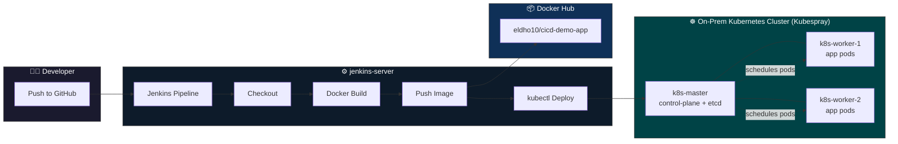

<div align="center">

# 🚀 CI/CD Pipeline: Git → Jenkins → Docker → On-Prem Kubernetes

**A production-style CI/CD pipeline delivering zero-downtime deployments to a self-managed Kubernetes cluster.**


[Overview](#-overview) • [Architecture](#-architecture) • [Zero-Downtime Strategy](#-zero-downtime-strategy) • [Setup](#-setup-summary) • [Troubleshooting](#-troubleshooting-notes) • [Screenshots](#-screenshots)

</div>

---

## 📖 Overview

This project demonstrates a complete, working CI/CD workflow — **without relying on any managed cloud services for the Kubernetes layer.** The cluster is bootstrapped entirely from scratch using **Kubespray** (Ansible-based) across plain EC2 instances acting as bare-metal-style nodes, simulating a genuine on-prem environment rather than leaning on EKS or any managed control plane.

**On every pipeline run, Jenkins automatically:**

| Step | Action |
|:---:|---|
| 1️⃣ | Checks out the latest code from GitHub |
| 2️⃣ | Builds a Docker image from the application |
| 3️⃣ | Pushes the image to Docker Hub |
| 4️⃣ | Updates the Kubernetes Deployment with the new image tag |
| 5️⃣ | Performs a **zero-downtime rolling update** and verifies the rollout |

---

## 🏗 Architecture



| Node | Role | Details |
|---|---|---|
| 🧰 `jenkins-server` | CI/CD orchestration | Jenkins 2.555.3, Docker, kubectl |
| 🎛️ `k8s-master` | Control plane + etcd | Provisioned via Kubespray |
| ⚙️ `k8s-worker-1` | Worker node | Runs application pods |
| ⚙️ `k8s-worker-2` | Worker node | Runs application pods |

All 4 nodes are EC2 instances (`c7i-flex.large`, `ap-south-1`) in a shared VPC/subnet — simulating on-prem topology. **Docker Hub** serves as the container registry.

---

## 🧱 Tech Stack

- **Provisioning:** AWS EC2 · Kubespray (Ansible)
- **Application:** Node.js + Express
- **Containerization:** Docker
- **CI/CD:** Jenkins (Declarative Pipeline)
- **Orchestration:** Kubernetes v1.31.4 (self-managed, 3 nodes)
- **Registry:** Docker Hub

---

## 📂 Repository Structure

```
.
├── index.js              # Express application
├── Dockerfile            # Container image definition
├── .dockerignore
├── Jenkinsfile           # Declarative CI/CD pipeline
├── k8s/
│   ├── deployment.yaml   # 3-replica Deployment, rolling update strategy
│   └── service.yaml      # NodePort Service (port 30080)
└── screenshots/          # Evidence of a working pipeline
```

---

## 🛡 Zero-Downtime Strategy

```yaml
strategy:
  type: RollingUpdate
  rollingUpdate:
    maxUnavailable: 0
    maxSurge: 1
```

> `maxUnavailable: 0` guarantees Kubernetes **never** terminates an old pod until a new one passes its readiness probe. Combined with `readinessProbe`/`livenessProbe` health checks, the application stays reachable throughout every deployment — no dropped requests, no downtime window.

---

## ⚡ Setup Summary

1. **Provision 4 EC2 instances** (Ubuntu 22.04 LTS) in a shared VPC/security group, with SSH, Jenkins (`8080`), and the NodePort range (`30000–32767`) open.
2. **Bootstrap the Kubernetes cluster** with Kubespray:
   ```bash
   ansible-playbook -i inventory/mycluster/inventory.ini --become --become-user=root cluster.yml
   ```
3. **Install Jenkins** on a dedicated node, alongside Docker and `kubectl`.
4. **Configure Jenkins credentials** — Docker Hub (username/password) and cluster `kubeconfig` (secret file).
5. **Create the Pipeline job**, pointed at this repo's `Jenkinsfile` via *"Pipeline script from SCM."*
6. **Apply the initial Deployment manually** once (`kubectl apply -f k8s/deployment.yaml`) — every subsequent Jenkins run updates the image in place via `kubectl set image`, triggering the rolling update.

---

## 🔧 Troubleshooting Notes

*Real issues hit during this build — documented because they're common gotchas, not obscure edge cases.*

<details>
<summary><b>Ansible / Python version mismatch</b></summary>
<br>
Kubespray's <code>main</code> branch pinned <code>ansible==11.13.0</code>, which requires Python 3.11+. Ubuntu 22.04 ships Python 3.10. Fixed by using an older Kubespray release tag (<code>v2.27.0</code>) pinned to <code>ansible==9.13.0</code>, which supports Python 3.10.
</details>

<details>
<summary><b>Jenkins GPG signing key rotation</b></summary>
<br>
Jenkins rotates its Debian repo signing key periodically (~3-year expiry). The commonly-referenced <code>jenkins.io-2023.key</code> had expired; switching to the current <code>jenkins.io-2026.key</code> resolved the <code>NO_PUBKEY</code> apt error.
</details>

<details>
<summary><b>Jenkins / Java version requirement</b></summary>
<br>
Jenkins 2.555.3 requires Java 21+ — Java 17 causes an immediate startup failure. Fixed by installing <code>openjdk-21-jdk</code> and setting it as default via <code>update-alternatives</code>.
</details>

<details>
<summary><b>kubeconfig pointing to 127.0.0.1</b></summary>
<br>
The kubeconfig generated on <code>k8s-master</code> defaults to <code>127.0.0.1:6443</code>, which only works locally. Since Jenkins runs on a separate node, the server address had to be changed to <code>k8s-master</code>'s private IP for cross-node access.
</details>

<details>
<summary><b>Docker permission denied in Jenkins</b></summary>
<br>
Adding the <code>jenkins</code> user to the <code>docker</code> group has no effect until the Jenkins service is restarted — group membership is only read at process start.
</details>

---

## 📸 Screenshots

<table>
<tr>
<td align="center"><br><sub>All 3 Kubernetes nodes <code>Ready</code></sub></td>
<td align="center"><br><sub>Jenkins pipeline — all stages passing</sub></td>
</tr>
<tr>
<td align="center"><br><sub>Image pushed to Docker Hub with build tags</sub></td>
<td align="center"><br><sub><code>kubectl get pods</code> — 3/3 running</sub></td>
</tr>
<tr>
<td align="center"><br><sub><code>kubectl get deployments</code> — 3/3 available</sub></td>
<td align="center"><br><sub>Successful rollout confirmation</sub></td>
</tr>
<tr>
<td align="center"><br><sub>Application reachable via NodePort</sub></td>
<td align="center"><br><sub>Jenkins home</sub></td>
</tr>
<tr>
<td align="center" colspan="2"><br><sub>All 4 nodes running on AWS EC2</sub></td>
</tr>
</table>

---

<div align="center">

## 👤 Author

**Eldho Sabu**

[](https://github.com/Eldho2827)
[](https://www.linkedin.com/in/eldhosabu08)

</div>
