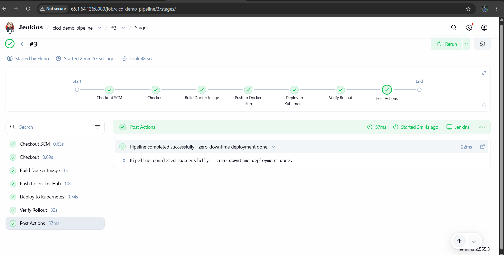
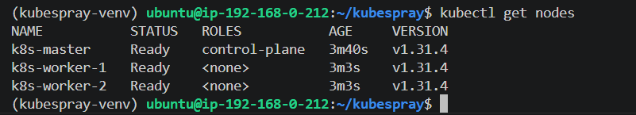
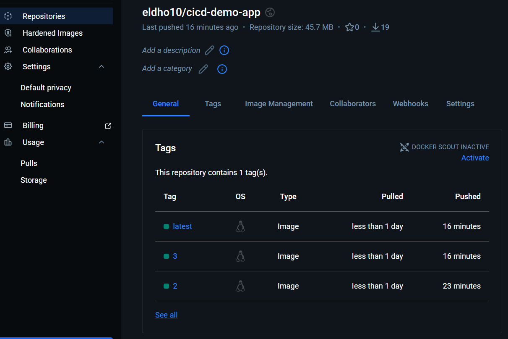
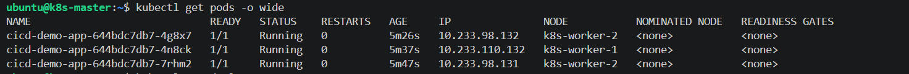
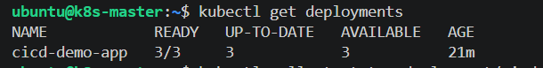
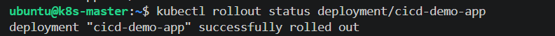
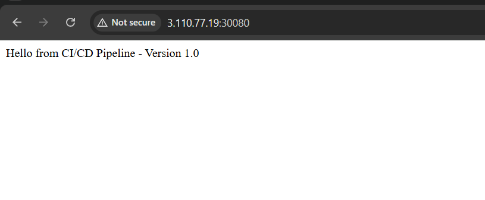
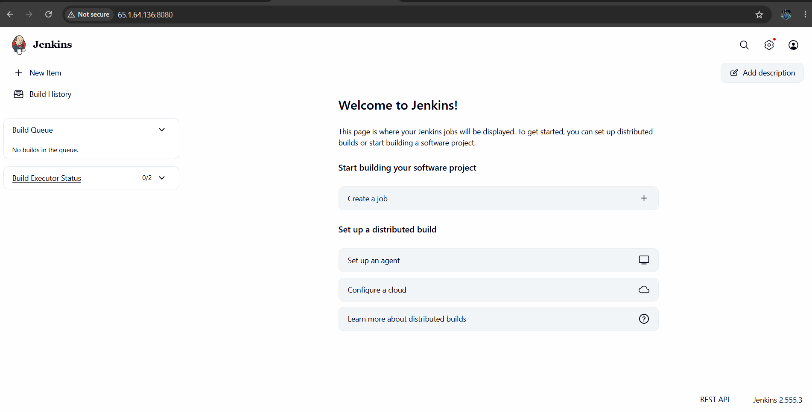
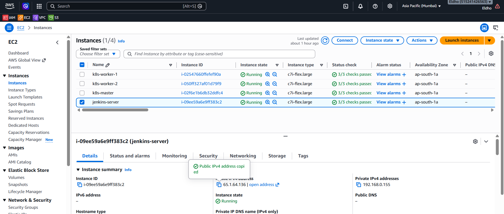

# CI/CD Pipeline: Git → Jenkins → Docker → On-Prem Kubernetes

A complete, working CI/CD pipeline that builds a Node.js application, containerizes it with Docker, and deploys it to a self-managed ("on-prem style") Kubernetes cluster with zero-downtime rolling updates — all orchestrated through Jenkins.



## Overview

This project demonstrates an end-to-end CI/CD workflow without relying on any managed cloud services for the Kubernetes layer. The cluster is bootstrapped from scratch using **Kubespray** (Ansible-based) across plain EC2 instances acting as bare-metal-style nodes — simulating a real on-prem environment rather than using EKS or any managed control plane.

**What happens on every pipeline run:**
1. Jenkins checks out the latest code from this repository
2. Builds a Docker image from the app
3. Pushes the image to Docker Hub
4. Updates the Kubernetes Deployment with the new image tag
5. Performs a rolling update with **zero downtime** and verifies the rollout

## Architecture

| Component | Role | Details |
|---|---|---|
| `jenkins-server` | CI/CD orchestration | Jenkins 2.555.3, Docker, kubectl |
| `k8s-master` | Kubernetes control plane + etcd | Provisioned via Kubespray |
| `k8s-worker-1` | Worker node | Runs application pods |
| `k8s-worker-2` | Worker node | Runs application pods |

All 4 nodes are EC2 instances (`c7i-flex.large`, `ap-south-1`) in the same VPC/subnet, simulating an on-prem cluster topology. Docker Hub is used as the container registry.

```
GitHub  →  Jenkins  →  Docker Hub  →  Kubernetes (Kubespray cluster)
  │            │             │                │
  code      build/push    image store    3-replica Deployment
                                          + NodePort Service
```

## Tech Stack

- **Provisioning:** AWS EC2, Kubespray (Ansible)
- **Application:** Node.js + Express
- **Containerization:** Docker
- **CI/CD:** Jenkins (Declarative Pipeline)
- **Orchestration:** Kubernetes v1.31.4 (self-managed, 3 nodes)
- **Registry:** Docker Hub

## Repository Structure

```
.
├── index.js              # Express application
├── Dockerfile            # Container image definition
├── .dockerignore
├── Jenkinsfile           # Declarative CI/CD pipeline
├── k8s/
│   ├── deployment.yaml   # 3-replica Deployment with rolling update strategy
│   └── service.yaml      # NodePort Service (port 30080)
└── screenshots/          # Evidence of working pipeline (see below)
```

## Zero-Downtime Strategy

The Deployment uses:
```yaml
strategy:
  type: RollingUpdate
  rollingUpdate:
    maxUnavailable: 0
    maxSurge: 1
```
`maxUnavailable: 0` guarantees Kubernetes never terminates an old pod until a new one passes its readiness probe. Combined with `readinessProbe`/`livenessProbe` health checks, this ensures the application stays reachable throughout every deployment.

## Setup Summary

1. **Provision 4 EC2 instances** (Ubuntu 22.04 LTS, `c7i-flex.large`) in a shared VPC/security group with SSH, Jenkins (8080), and NodePort range (30000–32767) open.
2. **Bootstrap the Kubernetes cluster** using Kubespray:
   ```bash
   ansible-playbook -i inventory/mycluster/inventory.ini --become --become-user=root cluster.yml
   ```
3. **Install Jenkins** on a dedicated node, along with Docker and `kubectl`.
4. **Configure Jenkins credentials**: Docker Hub (username/password) and a cluster `kubeconfig` (secret file).
5. **Create the Pipeline job**, pointed at this repo's `Jenkinsfile` via "Pipeline script from SCM."
6. **Apply the initial Deployment manually** (`kubectl apply -f k8s/deployment.yaml`) — after that, every Jenkins run updates the image in place via `kubectl set image`, triggering the rolling update.

## Troubleshooting Notes (real issues hit during this build)

Documenting these because they're common gotchas, not obscure edge cases:

- **Ansible/Python version mismatch:** Kubespray's `main` branch pinned `ansible==11.13.0`, which requires Python 3.11+. Ubuntu 22.04 ships Python 3.10. Fixed by using an older Kubespray release tag (`v2.27.0`) pinned to `ansible==9.13.0`, which supports Python 3.10.
- **Jenkins GPG signing key rotation:** Jenkins rotates its Debian repo signing key periodically (documented, ~3-year expiry). The commonly-referenced `jenkins.io-2023.key` had expired; switching to the current `jenkins.io-2026.key` resolved the `NO_PUBKEY` apt error.
- **Jenkins/Java version requirement:** Jenkins 2.555.3 requires Java 21+; Java 17 causes an immediate startup failure. Installed `openjdk-21-jdk` and set it as default via `update-alternatives`.
- **kubeconfig pointing to `127.0.0.1`:** The kubeconfig generated on `k8s-master` defaults to `127.0.0.1:6443`, which only works locally. Since Jenkins runs on a separate node, the server address had to be changed to `k8s-master`'s private IP for cross-node access.
- **Docker permission denied in Jenkins:** Adding the `jenkins` user to the `docker` group has no effect until the Jenkins service is restarted, since group membership is read at process start.

## Screenshots

| Evidence | Description |
|---|---|
|  | All 3 Kubernetes nodes `Ready` |
|  | Jenkins pipeline — all stages passing |
|  | Image pushed to Docker Hub with build tags |
|  | `kubectl get pods` — 3/3 running |
|  | `kubectl get deployments` — 3/3 available |
|  | Successful rollout confirmation |
|  | Application reachable via NodePort |
|  | Jenkins home |
|  | All 4 nodes running on AWS |

## Author

**Eldho Sabu**
[GitHub](https://github.com/Eldho2827) · [LinkedIn](https://www.linkedin.com/in/eldhosabu08)
